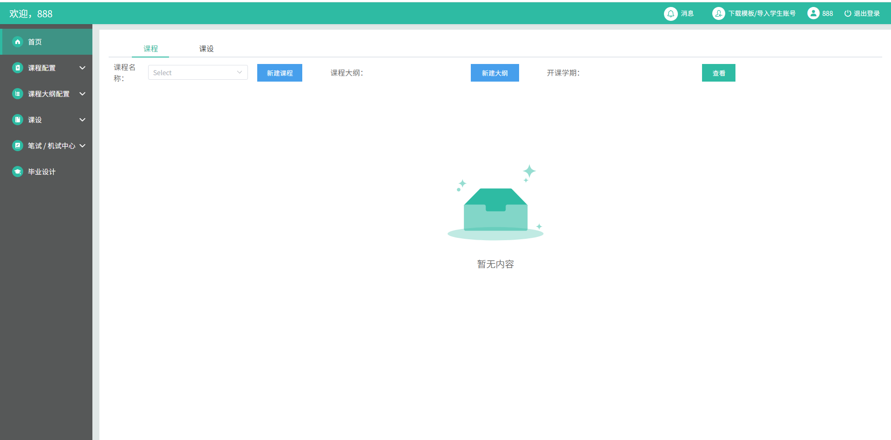
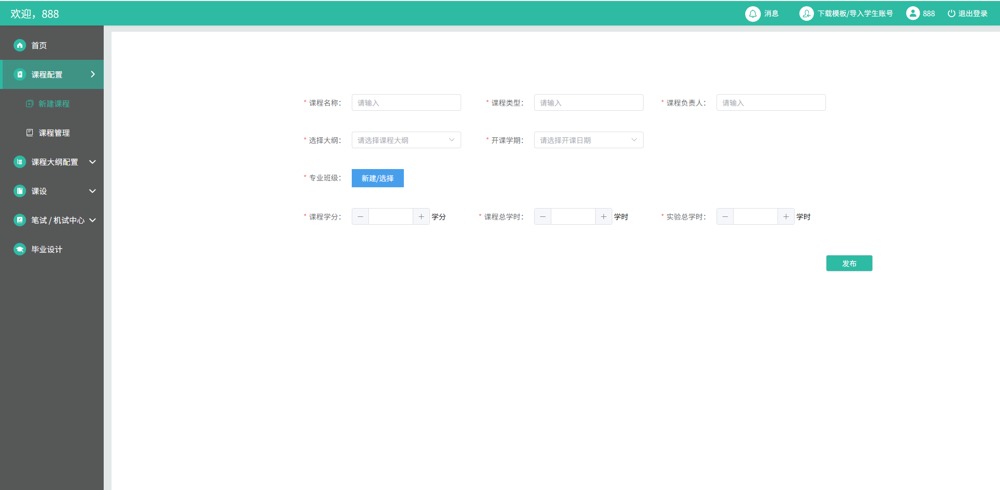
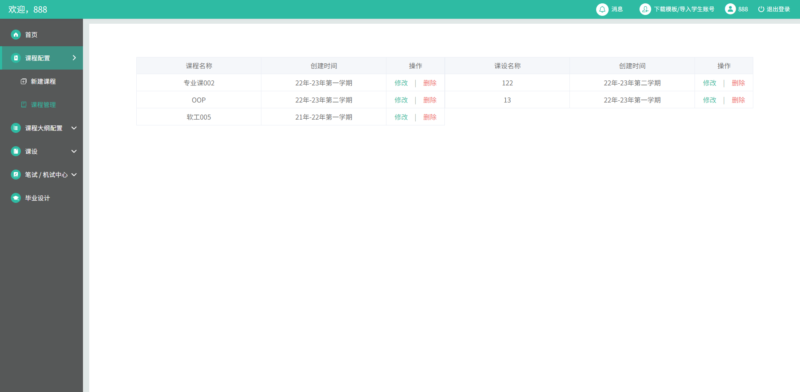
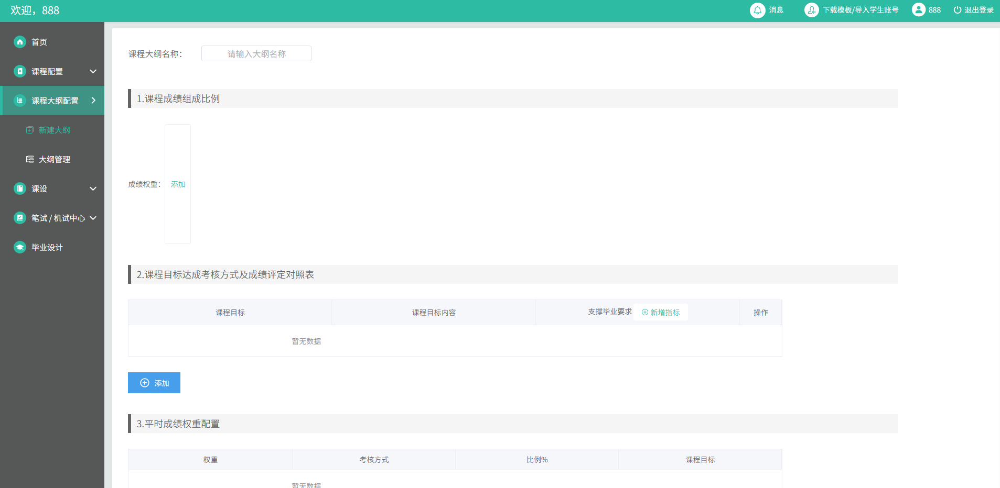
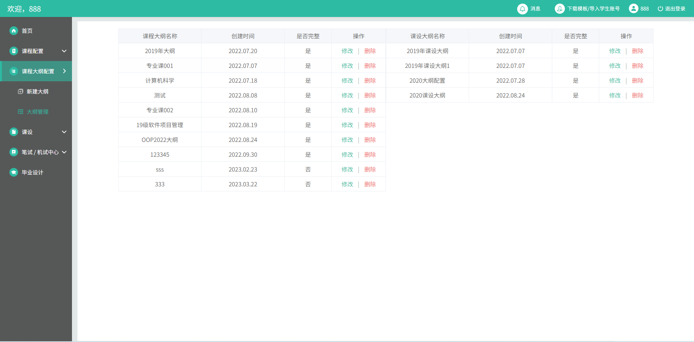
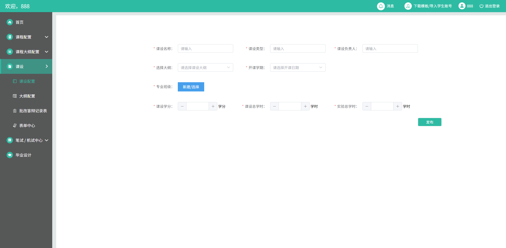
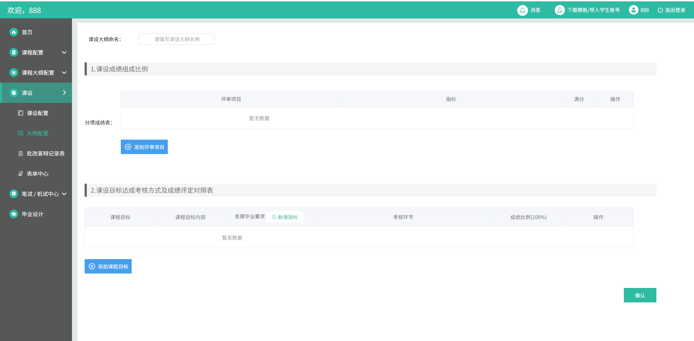
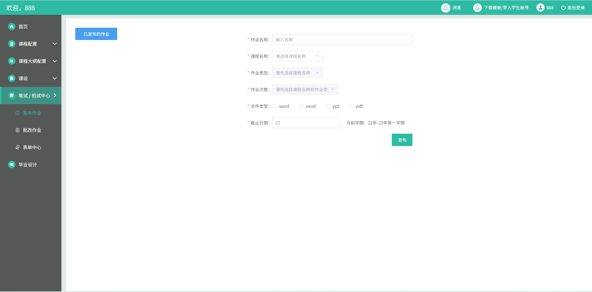
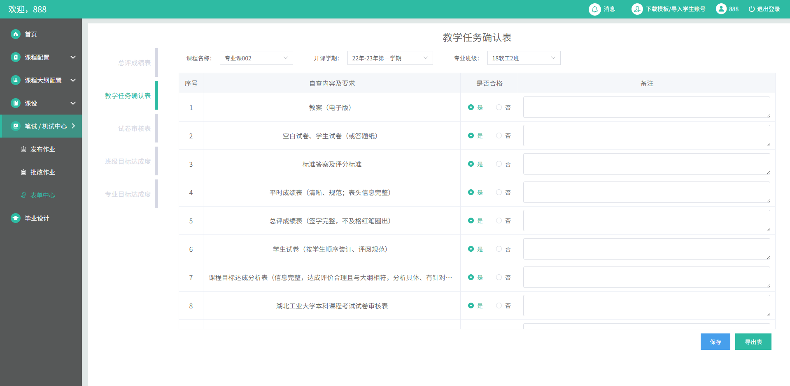
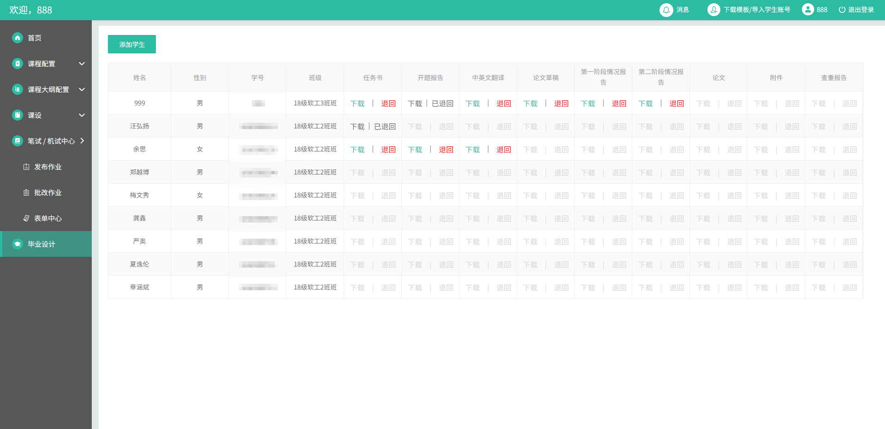

# EduSys - 教学管理系统

> EduSys 是一个基于 Vue 3 + TypeScript + Vite 的现代化教学管理系统，专为学校教学管理设计。系统支持课程配置、大纲管理、作业发布等功能，界面简洁专业，操作便捷。


## ✨ 特性

- **⚡️ 极速开发体验** - 基于 Vite 5，启动速度极快
- **🎨 TypeScript 支持** - 完整的类型定义，开发更安心
- **📦 现代化技术栈** - Vue 3 + Composition API
- **🎯 企业级 UI** - Element Plus 组件库
- **🗃️ 状态管理** - Pinia 状态管理
- **🛣️ 路由管理** - Vue Router 4
- **🌐 网络请求** - Axios 封装
- **📱 响应式布局** - 适配多端设备

## 📦 技术栈

| 技术 | 版本 | 用途 |
|------|------|------|
| Vue | ^3.2.25 | 核心框架 |
| TypeScript | ^4.5.4 | 类型安全 |
| Vite | ^2.9.9 | 构建工具 |
| Element Plus | ^2.2.2 | UI 组件库 |
| Pinia | ^2.0.14 | 状态管理 |
| Vue Router | ^4.0.15 | 路由管理 |
| Axios | ^0.27.2 | HTTP 客户端 |

## 🚀 快速开始

```bash
# 使用 npm
npm install

# 或使用 yarn
yarn install
```

### 开发模式

```bash
# 启动开发服务器
npm run dev
```

### 构建生产版本

```bash
# 构建生产版本
npm run build
```

## 📁 项目结构

```
EduSys/
├── public
```/             # 静态资源
├── src/
│   ├── assets/         # 资源文件
│   ├── components/     # 公共组件
│   ├── composables/    # 组合式函数
│   ├── router/         # 路由配置
│   ├── stores/         # Pinia 状态管理
│   ├── views/          # 页面视图
│   ├── App.vue         # 根组件
│   └── main.ts         # 入口文件
├── index.html          # HTML 模板
├── package.json        # 项目配置
├── tsconfig.json       # TypeScript 配置
├── vite.config.ts      # Vite 配置
└── README.md           # 项目说明
```

## 🖥️ 系统功能

### 主要功能模块
- **课程配置**：支持课程名称、类型、负责人等信息的配置
- **课程大纲**：支持课程大纲的创建和管理
- **课程管理**：支持课程的增删改查
- **作业管理**：支持作业的发布和批改
- **学生管理**：支持学生账号导入

### 功能界面截图

**登陆、首页页面**

| 登录 | 首页 |
|---------|---------|
|  |  |

**课程配置页面**

| 新建课程 | 课程管理 |
|---------|---------|
|  |  |

**课程大纲页面**

| 新建大纲 | 大纲管理 |
|---------|---------|
|  |  |

**课设页面**

| 课设配置 | 大纲配置 |
|---------|---------|
|  |  |

**笔试/机试页面**

| 发布作业 | 表单中心 |
|---------|---------|
|  |  |

**毕业设计页面**

| 界面 |
|---------|
|  |

## 📚 文档

- [Vue 3 文档](https://vuejs.org/)
- [Vite 文档](https://vitejs.dev/)
- [TypeScript 文档](https://www.typescriptlang.org/)
- [Element Plus 文档](https://element-plus.org/)
- [Pinia 文档](https://pinia.vuejs.org/)
- [Vue Router 文档](https://router.vuejs.org/)

## 🤝 贡献指南

1. Fork 本仓库
2. 创建你的分支 (`git checkout -b feature/AmazingFeature`)
3. 提交你的改动 (`git commit -m 'Add some AmazingFeature'`)
4. 推送到分支 (`git push origin feature/AmazingFeature`)
5. 创建一个 Pull Request

## 📄 许可证

本项目基于 MIT 许可证开源。

## 📧 联系方式

- **作者**: devwaf
- **仓库**: [EduSys](https://github.com/devwaf/EduSys)

---

如果本项目对你有帮助，欢迎 ⭐ Star 支持！